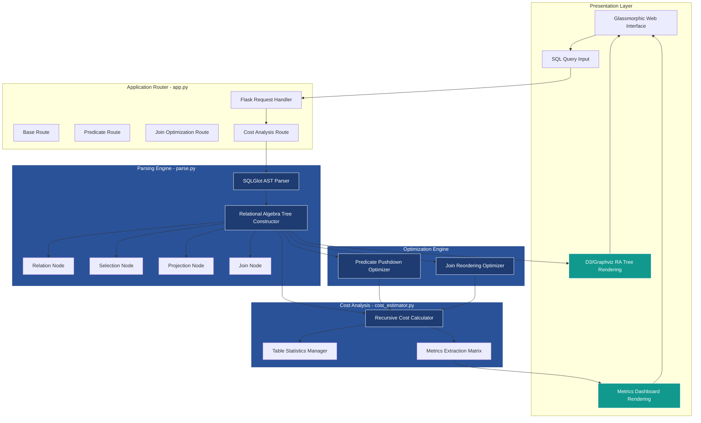

# OptiQuery: Advanced SQL Processing and Cost Optimization Engine

## Abstract
OptiQuery is an advanced, high-performance analytical tool designed for multi-tiered systems and linear relational databases. It parses, analyzes, and optimizes standard SQL queries into Relational Algebra (RA) trees. It employs rigorous heuristic optimization techniques, specifically Predicate Pushdown and Join Reordering, to theoretically minimize query execution costs. By providing a comprehensive comparative analysis of the abstract syntax trees before and after optimization, OptiQuery allows database engineers and developers to visualize execution complexity reductions through a sophisticated web interface.

---

## Motivation and Theoretical Foundation

In modern multi-tiered application architectures, database operations often represent the most significant performance bottleneck. While contemporary Relational Database Management Systems (RDBMS) possess sophisticated internal query planners, developers frequently interact with databases through abstract layers like ORMs (Object-Relational Mappers) or complex API gateways. This abstraction can obscure the true computational cost of the executed SQL, leading to sub-optimal queries that scale poorly under linear or exponential data growth.

OptiQuery was conceived to bridge this gap by bringing query execution transparency directly to the developer's workspace. By manually parsing SQL into Relational Algebra trees and applying deterministic heuristic optimizations—specifically focusing on minimizing intermediate relation sizes through early filtering (Predicate Pushdown) and optimal cross-referencing (Join Reordering)—OptiQuery serves dual purposes:

1. **Educational/Diagnostic Tooling:** It explicitly demonstrates *why* certain query formulations are computationally expensive by providing deterministic cost estimations for both naive and optimized execution paths.
2. **Architectural Validation:** It allows engineers designing complex linear relational schemas to validate their structural choices against simulated query execution costs before deploying to production environments where empirical testing might be cost-prohibitive.

The underlying theory assumes that disk I/O and memory staging for intermediate Cartesian products dominate execution time. By reducing the cardinality of relations as early as possible in the execution tree, we mathematically guarantee a lower upper bound on the computational complexity of the final result set generation.

---

## System Architecture

The following diagram illustrates the advanced structural flow of data and operations within the OptiQuery execution environment.

---

## Core Operational Modules

### 1. Parsing Engine (`parse.py`)
The system utilizes the `sqlglot` library to generate an Abstract Syntax Tree (AST) from raw SQL strings. This AST is systematically transformed into a Relational Algebra (RA) tree composed of abstract data structures representing fundamental relational operations (Selection, Projection, Join, and Relation).

### 2. Optimization Engine
OptiQuery executes modular optimization routines on the constructed RA tree:
- **Predicate Pushdown (`pred_pushdown.py`)**: Traverses the RA tree to relocate Selection operations as close to the base Relation nodes as possible. This minimizes the cardinality of intermediate datasets processed by subsequent resource-intensive operations, such as Joins.
- **Join Optimization (`join_optimization.py`)**: Analyzes multi-join configurations and reorders the execution sequence to prioritize joins that produce the smallest intermediate computational footprint.

### 3. Cost Estimation Subsystem (`cost_estimator.py`)
The estimator calculates two primary metrics for every node within the RA tree:
- **Operation Cost**: The isolated computational expense of the current node.
- **Cumulative Cost**: The aggregated expense of the current node and all descendant nodes within its specific branch.

Estimations rely on pre-fetched or mocked table row counts to dynamically dictate the cost formulas.

### 4. Application Controller (`app.py`)
The Flask routing matrix serves as the orchestrator. It manages the state of the active RA tree, invokes the parsers and optimizers based on client requests, extracts high-level analytical metrics (e.g., precise node counts, absolute cost disparities), and bridges the logic tier with the rendering tier.

---

## Advanced Presentation Layer

The web interface is engineered using a modern glassmorphic design paradigm layered over a dynamically animated CSS gradient mesh. 

**Analytical Data Displays:**
- **D3 Graphviz Integration**: Renders the complete, interactive Relational Algebra trees directly in the viewport, mapping exact cumulative cost integers to individual procedural nodes.
- **Performance Metrics Dashboard**: A structured grid calculating percentage-based optimization yields, absolute computational reductions, and categorical node distributions (Total Nodes, Total Joins, Base Table allocations).
